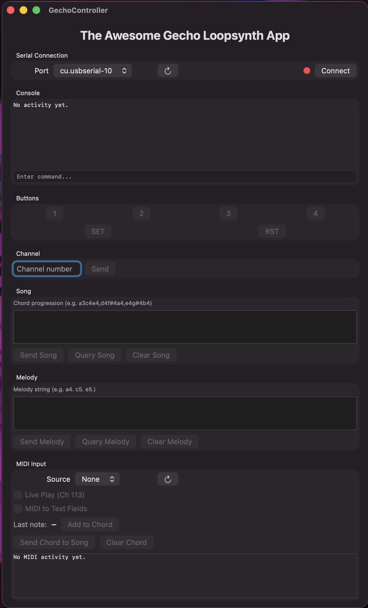

# 🎛️ GechoController — macOS App for the Gecho Loopsynth v1

A macOS controller app for the [Gecho Loopsynth v1](https://gechologic.com/v1/) synthesiser by Mario at Gechologic. Built with SwiftUI, this app provides a full serial interface to the Gecho over USB, including MIDI keyboard integration for real-time note playing and chord building.



---

## Requirements

- macOS 26.3 or later
- Xcode 14 or later (to build from source)
- Gecho Loopsynth **v1 hardware**
- Gecho firmware **v0.244** (other versions may work but are untested)
- CH340G USB driver (usually installs automatically on macOS
- Optional: any USB or Bluetooth MIDI keyboard for live play and chord input

---

## Features

- **Serial connection** via USB to the Gecho Loopsynth v1
- **Console** displaying all TX and RX messages in real time
- **Direct command entry** — type any TX command directly
- **Physical button simulation** — buttons 1, 2, 3, 4, SET and RST
- **Channel selector** — enter any channel number and send directly
- **Song input** — enter and send chord progressions in Gecho notation
- **Melody input** — enter and send melody strings in Gecho notation
- **Query and Clear** — query or clear stored Song and Melody from memory
- **MIDI input** — select any connected MIDI device as input source
- **Live Play (channel #113)** — play the Gecho toy box sampler in real time from a MIDI keyboard
- **MIDI to Text Field** — route MIDI keyboard input directly into the Song or Melody text fields
- **Chord Builder** — add notes one at a time from a MIDI keyboard to build chords, then send to Song
- **MIDI console** — displays all incoming MIDI messages

---

## Getting Started

### Building from Source

1. Clone this repository
2. Open `GechoController.xcodeproj` in Xcode
3. In **Signing & Capabilities**, set your own Development Team
4. Make sure **App Sandbox** has **USB** enabled under Hardware, or remove the sandbox entirely for personal use
5. Press **Cmd + R** to build and run

### Connecting the Gecho

1. Connect your Gecho Loopsynth v1 via USB
2. Ensure the sliding switch is in the **ON** position
3. The **RDY (Ready) LED** should be blinking on the synth
4. Open GechoController and select the port from the dropdown — it will appear as something like `cu.usbserial-XXXX` or `cu.wchusbserial-XXXX`
5. Click **Connect**
6. If successful, the console will display the handshake response `Hi there!` followed by the firmware version
7. If connection fails, the console will display `[Error] Handshake Failed. Check connection!` followed by `[Disconnected]`

### CH340G Driver

The Gecho v1 uses a CH340G USB-to-serial chip. On most modern macOS versions the driver installs automatically. If the port does not appear in the dropdown, install the driver manually from the official WCH source:

**https://www.wch-ic.com/downloads/CH341SER_MAC_ZIP.html**

After installing, unplug and replug the Gecho and the port should appear.

---

## Using the App

### Buttons

The four numbered buttons (1–4), SET and RST simulate pressing the physical buttons on the Gecho board. **Note:** button commands are only processed by the Gecho when it is in the idle state. During playback, the Gecho's audio loop only reads physical GPIO pins and ignores all serial button commands. Always use the physical buttons on the board during active playback.

### Channel

Enter any valid channel number in the Channel field and press **Send** to activate that channel. See the [Channel List](#channel-list) section below for all available channels.

### Song and Melody

Enter a chord progression in the Song field using Gecho notation (see [Note & Chord Format](#note--chord-format) below). Enter a melody string in the Melody field.

**Important — always send Song before Melody.** Sending a SONG= command automatically clears the stored melody. This is hardcoded in the firmware. Always send Song first, then Melody.

- **Send Song** — sends `SONG=` followed by the Song field content, then automatically sends `MELODY=` if the Melody field is populated, then sends `CHAN=111` to begin playback
- **Query Song** — queries the stored song from the Gecho's EEPROM. The board replies then auto-resets. The app reconnects automatically and populates the Song field
- **Clear Song** — clears both the stored Song and Melody from EEPROM, then resets the board
- **Send Melody** — sends `MELODY=` followed by the Melody field content
- **Query Melody** — queries the stored melody from EEPROM. The board auto-resets after replying
- **Clear Melody** — clears only the stored melody, leaving the song intact

### MIDI Input

Select your MIDI device from the **Source** dropdown. Press the refresh button if your device is not listed.

**Live Play (Ch 113)** — when ticked, automatically selects channel #113 and routes all incoming MIDI note-on events to the Gecho as `FREQ=` commands, playing the toy box sampler in real time.

**MIDI to Text Fields** — when ticked, incoming MIDI notes are converted to Gecho note notation and appended to whichever text field (Song or Melody) is currently in focus.

### Chord Builder

1. Ensure **MIDI to Text Fields** is unticked
2. Play notes one at a time on your MIDI keyboard — each note is shown in the **Last note** display
3. Click **Add to Chord** to add each note to the current chord being built
4. Once you have your chord (typically 3 notes), click **Send Chord to Song** to append it to the Song field
5. Click **Clear Chord** to start a new chord

---

## Note & Chord Format

All notes are written in plain text using the following format:

| Element | Description |
|---------|-------------|
| `a3` / `c#4` / `f#5` | Note = letter (a–g) + optional sharp (#) + octave number (2–6) |
| `a3c4e4` | Chord = 3 notes with no separator (e.g. A minor: A3, C4, E4) |
| `a3c4e4,d4f#4a4,e4g#4b4` | Chord progression = chords separated by commas |
| `a4,c5,b4,g#4` | Melody = individual notes separated by commas |
| `.` | Rest / silence for one beat in a melody |

**Available note letters:** `a b c d e f g` (lowercase only)

**Sharps only — no flats.** Use enharmonic equivalents:

| Flat | Use |
|------|-----|
| Bb | a# |
| Eb | d# |
| Ab | g# |
| Db | c# |
| Gb | f# |

### Example — A minor I, V, IV, II progression

**Song:**
```
a3c4e4,e3g#3b3,d3f3a3,b3d4f4
```

**Melody:**
```
a4,c5,b4,g#4,a4,f4,d5,e5
```

---

## Serial TX Command Reference

All commands are plain text terminated with `\n` at **115200 baud**.

### Handshake

| Command | Response | Description |
|---------|----------|-------------|
| `Hi Gecho!` | `Hi there!` | Connection test |

### Button Simulation *(idle state only)*

| Command | Description |
|---------|-------------|
| `BTN=1` | Simulate pressing button 1 |
| `BTN=2` | Simulate pressing button 2 |
| `BTN=3` | Simulate pressing button 3 |
| `BTN=4` | Simulate pressing button 4 |
| `BTN=SET` | Simulate pressing SET button |
| `BTN=RST` | Full hardware reset |

> ⚠️ BTN= commands are **ignored during playback**. The Gecho audio loop only reads physical GPIO pins. Only BTN=RST works during channel #113.

### Channel Control

| Command | Description |
|---------|-------------|
| `CHAN=111` | Select any channel by number |
| `EXIT` | Stop playback, return to idle *(channel #113 only)* |

### Song & Melody

| Command | Description |
|---------|-------------|
| `SONG=a3c4e4,d4f#4a4` | Send chord progression — stores to EEPROM, **always clears melody** |
| `SONG=CLEAR` | Clear stored song AND melody from EEPROM |
| `MELODY=a4,c5,b4` | Send melody — stores to EEPROM, does **not** clear the song |
| `MELODY=CLEAR` | Clear stored melody only |
| `SONG?=` | Query stored song — board replies then **auto-resets** |
| `MELODY?=` | Query stored melody — board replies then **auto-resets** |

> ⚠️ Always send `SONG=` **before** `MELODY=` — sending SONG= after MELODY= will wipe the melody.

### Real-Time Note Playing *(channel #113 only)*

| Command | Description |
|---------|-------------|
| `FREQ=440.00` | Play note at frequency in Hz using toy box sampler |
| `FREQ=261.63` | Middle C (C4) — MIDI note 60 |
| `FREQ=523.25` | C5 |

**MIDI to Hz formula:** `frequency = 440.0 × 2^((midiNote − 69) / 12)`

### Preview

| Command | Description |
|---------|-------------|
| `PREVIEW=LP:song_data` | Preview with low-pass filters |
| `PREVIEW=HP:song_data` | Preview with high-pass filters |

### Flash Memory

| Command | Response | Description |
|---------|----------|-------------|
| `SAVE=songname` | — | Save current song to flash — board **auto-resets** after |
| `LOAD=songname` | Song string + `;\n` | Load song from flash — board **auto-resets** after |
| `ERASE=ALL` | — | Erase ALL custom data from flash — board **auto-resets** after |
| `MAP?` | Channel map | Returns map of all saved channels in flash |

> ⚠️ SAVE=, LOAD=, ERASE=ALL and MAP? all cause an **automatic board reset** after executing.

### Device Information

| Command | Response | Description |
|---------|----------|-------------|
| `FN=VER` | `[FW=0.244]` | Firmware version as plain text |
| `FN=UID` | `[xxxx-xxxx-xxxx]` | Hardware unique ID |
| `FN=BNO` | Binary ID | Firmware binary build number |
| `FN=BHS` | Hash string | Firmware binary hash |
| `FN=UHS` | UID hash | UID hash for Gechologists authentication |

### Correct Command Sequences

| Workflow | Sequence |
|----------|----------|
| Play a new song with melody | `SONG=...\n` → 200ms → `MELODY=...\n` → 200ms → `CHAN=111\n` |
| Query stored content | `SONG?=\n` → capture reply → auto-reset → reconnect → `MELODY?=\n` → capture reply → reconnect |
| Clear everything | `SONG=CLEAR\n` → 200ms → `BTN=RST\n` |
| Stop playback | `EXIT\n` *(channel #113 only)* |
| Real-time MIDI play | `CHAN=113\n` → send `FREQ=xxx.xx\n` per note |
| Check firmware version | `FN=VER\n` → read reply |
| Reset board | `BTN=RST\n` |

---

## Known Limitations

| Limitation | Detail |
|------------|--------|
| BTN= ignored during playback | Audio loop only reads physical GPIO pins. No serial button commands work during playback except BTN=RST in channel #113. |
| Channel #123 is serial-deaf | Tempo configuration uses a physical-button-only loop. All serial commands including BTN=RST are ignored. Exit only with physical SET or RST button. |
| Channels #41–44 are serial-deaf | Custom song programming channels also use physical-button-only loops. Same limitation as #123. |
| SONG= always clears MELODY | Hardcoded in firmware. Always send SONG= first, then MELODY=. |
| No independent melody/chord volume | Mix levels are hardcoded constants in firmware. No serial command to change them. |
| Melody-only playback not possible | Channel #111 exits immediately if no chord progression is stored. Use a minimal drone chord as a workaround. |
| No flat (b) syntax | Only sharps (#) supported. Use enharmonic equivalents. |
| SONG?= and MELODY?= reset the board | Both query commands cause automatic board reset after replying. |

---

## Channel List

A selection of useful channels. Enter these in the Channel field and press Send.

| Channel | Description |
|---------|-------------|
| `1` | Demo song #1 — melody with high-pass filters |
| `2` | Demo song #2 — "Freedom of Creation" |
| `3` | Random demo song with low-pass filters |
| `4` | Demo song #21 — "Ghost in the Shell" (chords only) |
| `11` | Pure white noise |
| `12` | Slowly evolving low-pass filters — "Song of Wind and Ice" |
| `21` | Waves of the Sea — noise/resonance via sensors |
| `22` | Nostromo |
| `23` | Alien Spaceship |
| `33` | DCO Synth — 24 oscillators, sensor controlled |
| `34` | DCO Synth with MIDI *(requires hardware MIDI extension)* |
| `111` | Play stored/generated song |
| `113` | Play notes from app via FREQ= commands (toy box sampler) |
| `123` | Configure tempo (15–330 BPM) ⚠️ serial-deaf |
| `222` | Generate random chord progression |
| `231` | Simple drum kit — sensor controlled |
| `234` | Basic drum sequencer |
| `314` | Songs of Pi |
| `411` | Real-time Granular Sampler |
| `421` | Decaying Reverb — increasing buffer |
| `432` | Infinite looper with octave pitch shifter |
| `441` | Bytebeat chiptune songs |
| `1111` | Edit stored song |
| `4112` | Canon in D by Pachelbel |
| `4321` | Reset all user settings to default |

For the full channel list refer to the [Gecho v1 Manual](https://gechologic.com/manual_v244).

---

## Technical Notes

- The Gecho v1 uses an **STM32F405** microcontroller
- USB connection is via a **CH340G** USB-to-serial chip
- Serial communication is plain text at **115200 baud**
- Persistent storage uses onboard **EEPROM/flash memory**
- EEPROM backup (via BAT+3V pad) requires your battery pack to be connected to the BAT+3V pad on the board to survive power-off. Flash storage via SAVE= is unconditionally persistent.
- The **MIDI hardware extension** (optocoupler + resistors solderable on the v1 board) enables channels such as #34 for direct MIDI-in from hardware. See [gechologic.com/diy-midi-extension](https://gechologic.com/diy-midi-extension) for the build guide.

---

## License

Copyright © 2026 John McMillan

This app is released under the **MIT License**. See [LICENSE](LICENSE) for details.

The Gecho Loopsynth v1 firmware is also MIT licensed. Copyright © 2019 Mario / Gechologic.

---

## Disclaimer

**This app is provided as-is, with no support, warranty, or guarantee of any kind.**

- This is an independent community project and is **not officially supported**. No technical support, bug fixes, or updates are promised or implied.
- The author accepts no responsibility or liability for any damage, malfunction, data loss, or harm to your Gecho Loopsynth hardware or any other equipment, howsoever caused, arising from the use or misuse of this app.
- Use of this app is entirely **at your own risk**. You are responsible for ensuring that any commands sent to your Gecho Loopsynth are appropriate for your hardware and firmware version.
- This app communicates directly with your hardware over a serial connection. Incorrect or unexpected commands could affect the state of your device. Always ensure your Gecho firmware is up to date and that you understand the commands being sent before using them.

By downloading, building, or using this app you agree to these terms.

---

## Credits

- **Gecho Loopsynth v1** hardware and firmware by [Mario at Gechologic](https://gechologic.com)
- Firmware source: [github.com/h3o/Gecho_v1](https://github.com/h3o/Gecho_v1)
- Serial command reference derived from analysis of the v1 firmware source code
- App built with Xcode, Swift and SwiftUI

---

## Contributing

This repository is **not open to pull requests or contributions**. The code is shared publicly for personal use and reference only.

You are welcome to **fork** this repository and do your own thing with it under the terms of the MIT license — just keep the copyright notice intact as required.

Please do not submit pull requests, issues, or feature requests as they will not be actioned.

---

*This app is an independent community project and is not affiliated with or endorsed by Gechologic.*
